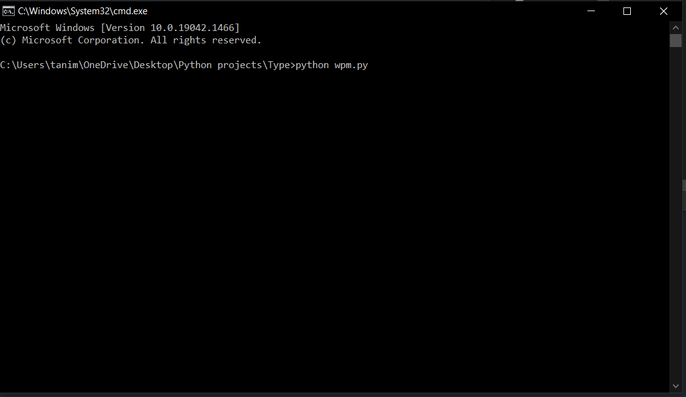
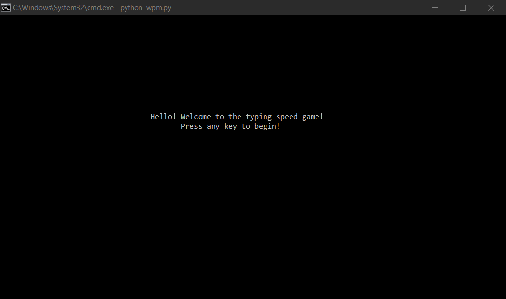
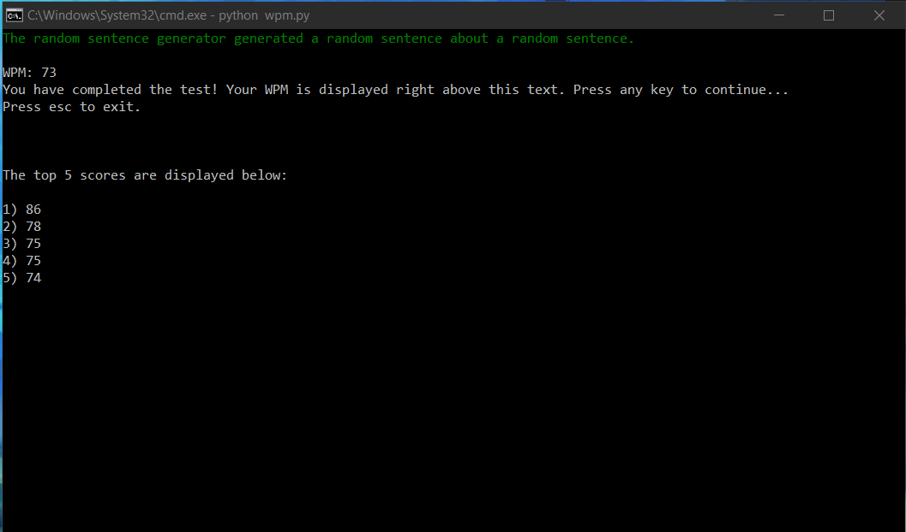

## Words-Per-Minute
A terminal app written in python utilizing the curses module that tests the user's ability to type. 

# How to Run?

Since this is a terminal app, it must be run from the terminal. For our purposes, we are going to use the windows command prompt. 
In order to run the program we simply need to open the command prompt inside the directory where the main program code is located and then type in:
```python wpm.py```

Just as it is shown below:



After running the command, the user will be greeted by the following screen:




# How the Program Works


First, the user will be shown a random sentence on the terminal screen. Then the user must type the shown sentence exactly as it is written on the screen.
The words per minute counter (WPM on screen) will be continously changing and will depend on the user's accuracy in typing the correct keys and/or the amount of time the
user takes to complete typing the entire sentence. 


Below is an example sentence, where the correct keystrokes are highlighted as green and the incorrect keystrokes are highlighted as red.


When the user finishes typiing an entire sentence correctly. Their wpm score will be shown, and the top 5 scores recorded so far will also be shown:




# Notes

1) The user must have python installed on their computer.

2) The program currently randomizes 40 different sentences. If the user wishes to add more sentences, they can make up their own, or they can visit the random sentence generator [website](https://randomwordgenerator.com/sentence.php) and add a sentence to a new line in the test.txt file. 

3) If the user wishes to wipe the current top 5 score, they need to simply go in the high_score.txt file, erase all of its contents and simply save the empty file. 
