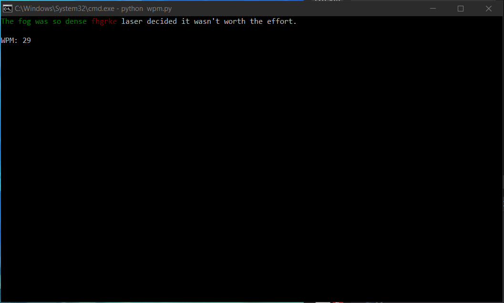

# words-per-minute
A terminal app written in python utilizing the curses module that tests the user's ability to type. 

# How Does it Work?

Since this is a terminal app, it must be run from the terminal. For our purposes, we are going to use the windows command prompt. 
In order to run the program we simply need to open the command prompt inside the directory where the main program code is located and then type in:
```python wpm.py```
 ``` 


The player will be shown a random sentence on the terminal screen as shown below:



